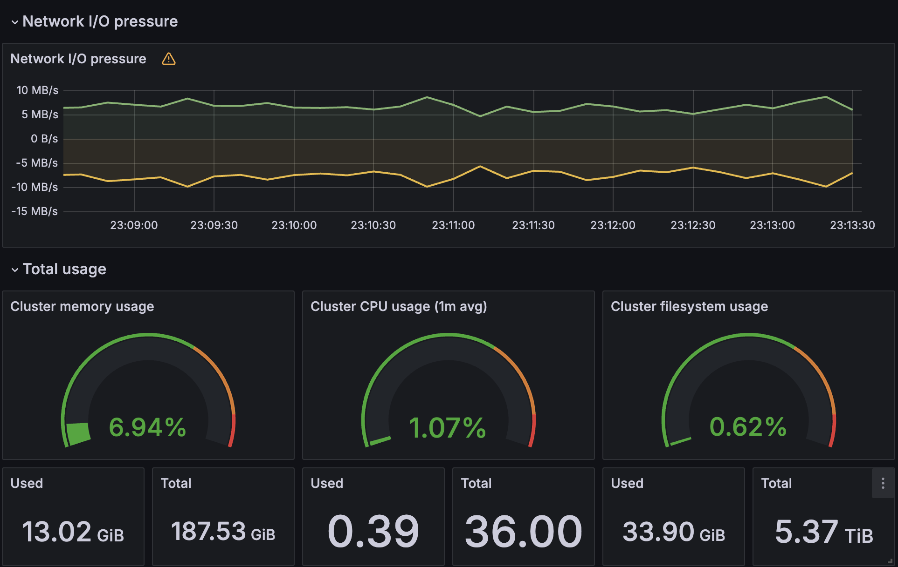

# My Kubernetes Lab - kubernerdes.lab 

This is the chronicles of deploying Kubernetes (EKS Anywhere) in my HomeLab: The Kubernerdes lab.

**Goal:**  
Create my own EKS Anywhere environment using bare metal (Intel NUCs) starting with a USB stick with install media (Ubuntu Server 22.04 - though I am considering Ubuntu Desktop now that I have been "using their ecosystem" for a while) and an Internet connection.  I want this environment to be completely independent of everything else in my lab. 

**Status:**  
Work in Progress.  But, everything you need is in the [AWS Docs](https://anywhere.eks.amazonaws.com/docs/) - dedicate an afternoon and you'll be far enough along to roll out a K8s cluster.  Also - I am likely going through several iterations of how to name my files appropriately - like incuding K8s version, or node count in the file name.
I anticiapte that there will be some refactoring occurring - mostly regarding where different steps/tasks are, and the filenames where the tasks are documented.  

**Prologue:**  
Note:  Anything in my "scripts" that is encapsulated in a bash routine - ie. my_route(){ code; } generally means it is some optional code that I won't generally use. (like installing the Desktop UI)

The ["Scripts"](./Scripts) directory is where all the scripts live (obviously?), but I have created a directory in the Scripts directory that will have symlinks back to the parent dir.  The reason: not all the scripts apply to every implementation style (i.e. bareMetal is different than vSphere) but there are a number of common scripts.

This project has been created to be a [network enclave](https://en.wikipedia.org/wiki/Network_enclave) - meaning, it should be able to "stand alone" and function.  That carries some assumptions:

* DNS - I have created a standalone domain "kubernerdes.lab". 
* DHCP - The installer will handle DHCP during the install via the "boots container" hosted on the "admin host".  The boots container then gets migrated to the running cluster (and continues to handle DHCP for this network).  I will be exploring how to have both the "boots DHCP" and my own "subnet DHCP" coexist.
* Cluster Access - and this is where things potentially get tricky, if you let it.  If I simply create the enclave with **everything** in that enclave, things are relatively straight-forward.  Therefore, I am creating this repo with that in mind - everything is in the 10.10.12.0/22 subnet.
* Lab User:  "My Ansible" (mansible)
* File Naming:  I will be including a numeric representation which signifies how many Control-Plane and Workers (3_0 = 3 CP, 0 workers).  Also there will be occassions where I also include the Kubernetes version in the file name.

It is worth noting that a portion of this repo is likely not applicable in most situations.  I am essentially start at the point where I am plumbing up a new interface on my Firewall, creating a new /22 CIDR off that interface, and starting from scratch - things you would not (or could not) need to do if you were in an enterprise situation.

## Steps
* Build the Admin Host (thekubernerd.kubernerdes.lab)
* Kickoff the EKS Install process
* Power On the NUCs (and select Network Boot (f12))
* Do some Post Install tasks
* Install some Apps and Ingress, etc..

## Build THEKUBERNERD Host
You will need to install Ubuntu on "TheKubernerd" (the "Admin Host" referenced in the docs).  

Then apply the [Post Install Script - THEKUBERNERD](Scripts/00_Post_Install_THEKUBERNERD.sh)

The EKS Anywhere build process will create all the PXE bits, etc..  EKS Anywhere is incredible.  
It will deploy a KIND Cluster using Docker to build a "bootstrap Cluster" - this will include all the necessary plumbing, etc.. to bootstrap the base OS on the Cluster Nodes.

The only "customization" I am going to pursue is hosting the OS Image and Hooks on my own webeserver, and my own DNS server for my Lab.    
* [Ansible](Scripts/10_Install_Ansible.sh)
* [EKS Tools](Scripts/11_Install_EKS_Tools.sh)
* [BIND](Scripts/15_Install_BIND9.sh)

While not necessary, I will include the WebServer in case you wish to host your own artifacts (such as: osImage, hookImages)
* [WWW Server](Scripts/Install_HTTP_Server.sh) - add WebServer to listen on 8080

Uneeded (this is all handled by the "tinkerbell boots" container):  
* [NFS Server](Scripts/Install_NFS_Server.sh) - add NFS Server to provide shared/persistent storage (I replaced the necessity for PVs with OpenEBS)  
* [DHCP Server](Scripts/Install_DHCP_Server.sh)
* TFTP

## Tested Configurations
My "inventory" or "hardware.csv" files do not include BMC info - primarily because my NUC(s) have no ILO/BMC.

| Control-Plane | Worker Nodes | GPU Nodes | Inventory File |
|:-------------:|:------------:|:---------:|:---------------|
| 3 | 0 | 0 | [Hardware 3_0](Files/hardware-3_0.csv) |
| 1 | 2 | 0 | [Hardware 1_2](Files/hardware-1_2.csv) |
| 3 | 0 | 1 | [Hardware 3_0_1](Files/hardware-3_0_1.csv) |

## Deploy EKS Anywhere Cluster
**ProTip:**
If you only use labels of "node=cp-machine" in your hardware.csv inventory file, and remove the WorkerNodeGroup from your clusterConfig, your Control-Plane nodes will not be tainted and workloads can run there.  (so, I will either have 3 x Control-Plane nodes that also act as Worker Nodes - or you have 1 x CP and 2 x Worker Nodes)  

I generally start with the following to rebuild my cluster  
[Install EKS Anywhere](Scripts/50_Deploy_BareMetal_EKS-A_Cluster.sh)

## Utilization
The following is my 3 x NUC cluster utilization with basic infrastructure components running (Prometheus/Grafana, openEBS, Cilium OSS/HubbleUI)  

## References
[EKS Anywhere - Landing Page](https://anywhere.eks.amazonaws.com/)  
[EKS Anywhere - Docs](https://anywhere.eks.amazonaws.com/docs/)  
[Ubuntu Server - Download](https://ubuntu.com/download/server)  

[Containers from the Couch - Search String: EKS Anywhere (YouTube)](https://www.youtube.com/@ContainersfromtheCouch/search?query=eks%20anywhere)

