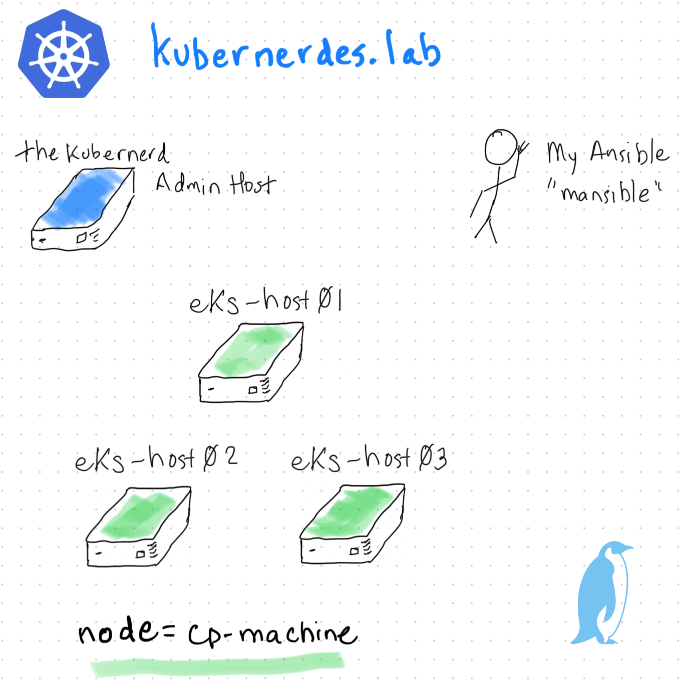

# kubernerdes.lab - My Kubernetes Lab

This is the chronicles of deploying Kubernetes (EKS Anywhere) in my HomeLab.The Kubernerdes lab.

It is worth noting that a portion of this repo is likely not applicable in most situations.  I am essentially plumbing up a new interface on my Firewall, creating a new /22 CIDR off that interface, and starting from scratch - things you would not (or could not) need to do if you were in an enterprise situation.

Goal:  to create my own EKS Anywhere environment from bare metal (Intel NUCs) and a USB stick with install media (Ubuntu Server 22.04).  I want this environment to be completely independent of everything else in my lab. 

## Build EKS-ADMIN Host
You will need to install Ubuntu on "Admin Host".  While I have ways of accomplishing this with automation, *that* is not in-scope to explain here.

[Post Install Script - THEKUBERNERD](Scripts/Post_Install_THEKUBERNERD.sh)

The EKS Anywhere build process will create all the PXE bits, etc..  EKS Anywhere is incredible.  
It will deploy a KIND Cluster using Docker to build a "bootstrap Cluster" - this will include all the necessary plumbing, etc.. to bootstrap the base OS on the Cluster Nodes.

The only "customization" I am going to pursue is hosting the OS Image and Hooks on my own webeserver, and my own DNS server for my Lab.    

* [BIND](Scripts/Install_BIND9.sh)
* [WWW](Scripts/Install_HTTP_Server.sh)

## Deploy EKS Anywhere Cluster
[Install EKS Anywhere](Scripts/Install_EKS_Anywhere.sh)

## References
[EKS Anywhere](https://anywhere.eks.amazonaws.com/)  
[EKS Anywhere Docs](https://anywhere.eks.amazonaws.com/docs/)  
[Ubuntu Server](https://ubuntu.com/download/server)  

[Containers from the Couch - EKS Anywhere (YouTube)](https://www.youtube.com/@ContainersfromtheCouch/search?query=eks%20anywhere)

